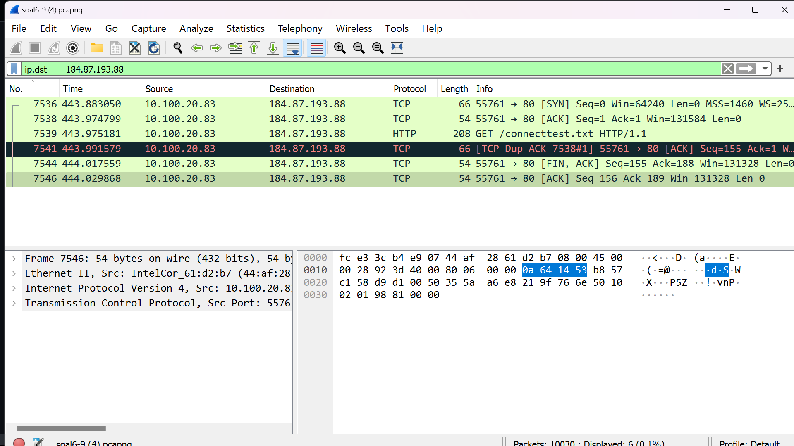
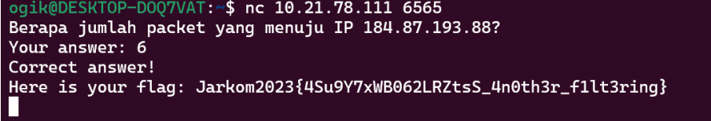
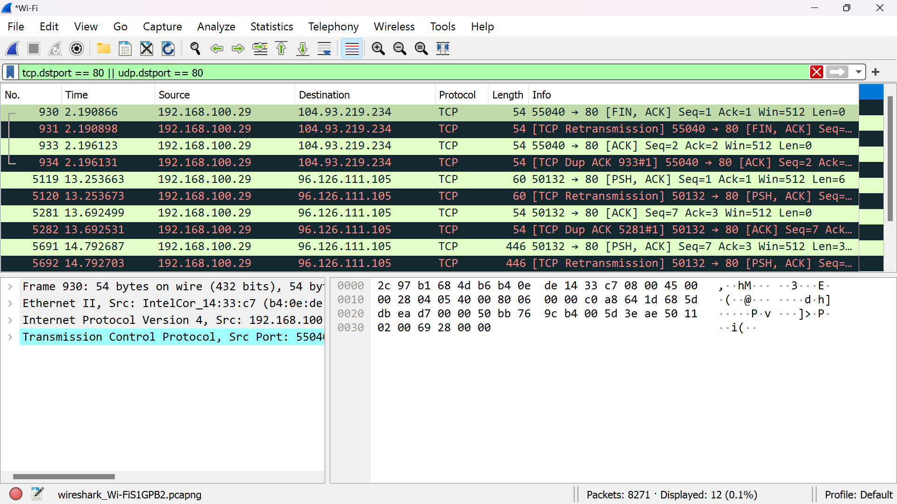
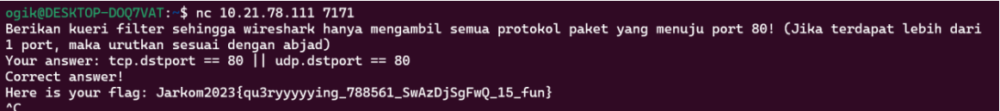
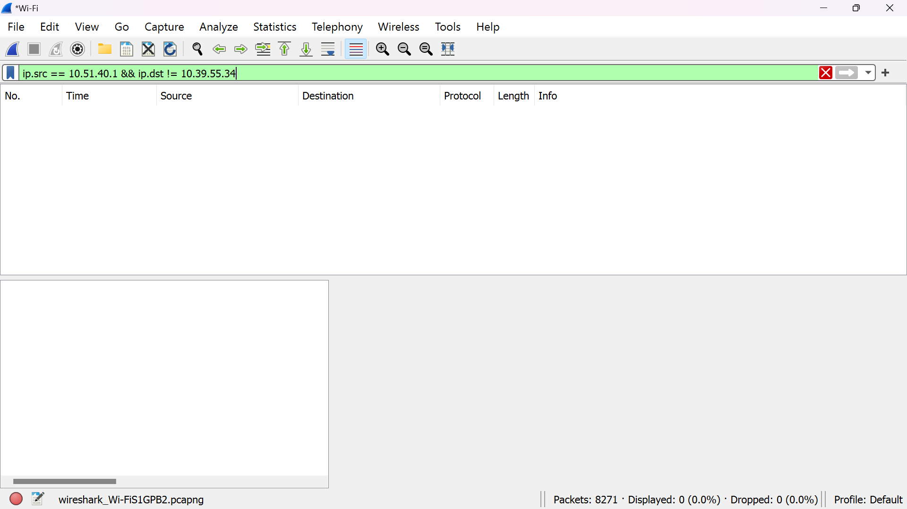
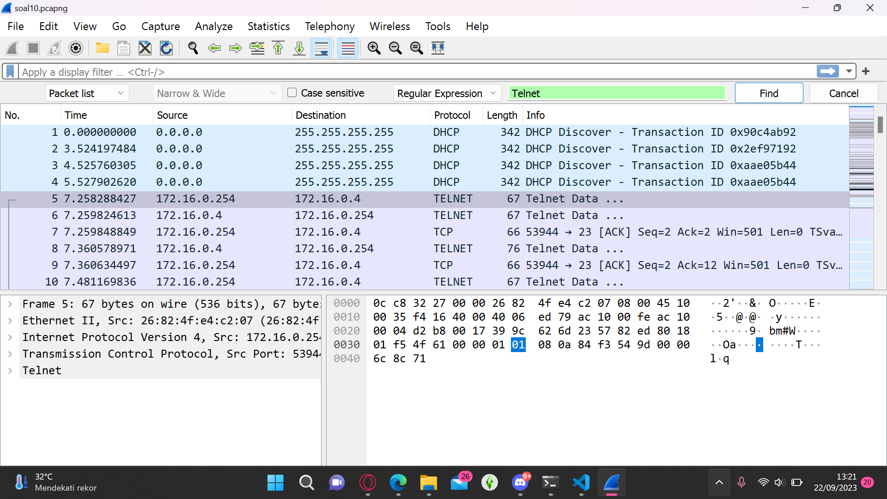
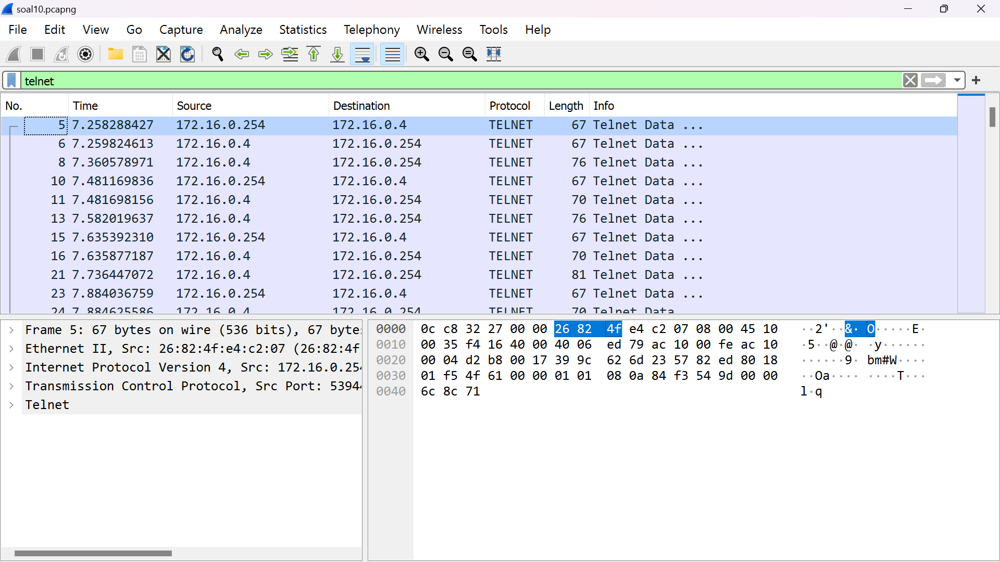
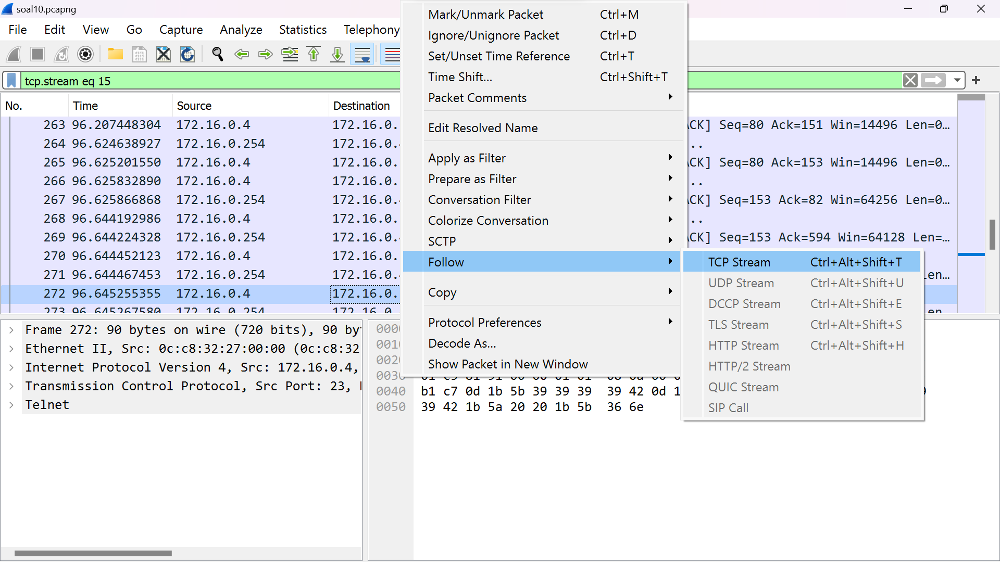
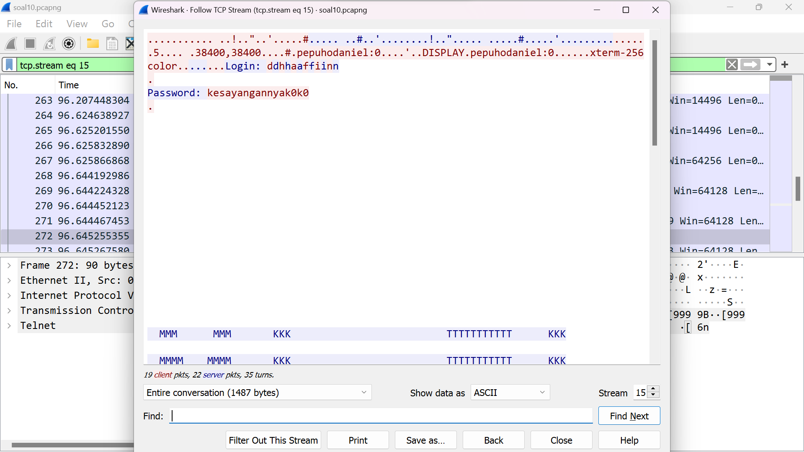

# Jarkom-Modul-1-D16-2023
# D16 
### MAS DICKY TOLONG DIISIIII
### Widian Sasi Disertasiani ( 5025211024)
# SOAL MODUL 1

7. Berapa jumlah packet yang menuju IP 184.87.193.88?

Lakukan Display Filter dengan kueri berikut ip.dst == 184.87.193.88. Lalu hitung jumlah output packet dari filter tersebut. 

8. Berikan kueri filter sehingga wireshark hanya mengambil semua protokol paket yang menuju port 80! (Jika terdapat lebih dari 1 port, maka urutkan sesuai dengan abjad).

Input kueri berikut tcp.dstport == 80 || udp.dstport == 80. TCP dan UDP merupakan komunikasi paling umum yang digunakan untuk mengakses http/ port 80. 

9. Berikan kueri filter sehingga wireshark hanya mengambil paket yang berasal dari alamat 10.51.40.1 tetapi tidak menuju ke alamat 10.39.55.34!

Input kueri berikut ip.src == 10.51.40.1 && ip.dst != 10.39.55.34.

10.Sebutkan kredensial yang benar ketika user mencoba login menggunakan Telnet

Ada beberapa cara untuk menampilkan packet yang masi memiliki hubungan dengan "Telnet" diantaranya:
 Bisa menggunakan search 
 

 Bisa dengan display filter
 

 

 Lalu akan muncul id dan password
 
