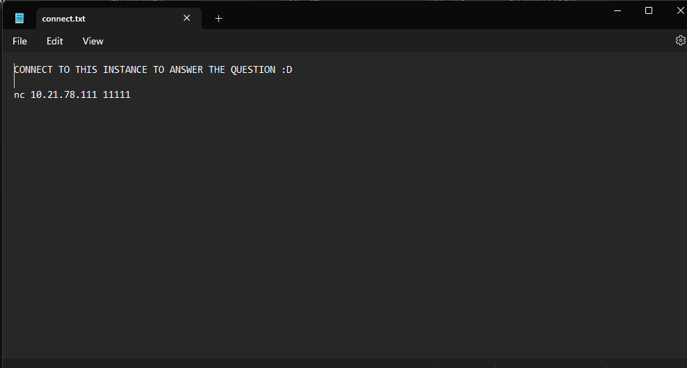

# Jarkom-Modul-1-D16-2023
### D16 | JARKOM D
#### Dicky Indra Kuncahyo (5025201250)
#### Widian Sasi Disertasiani ( 5025211024)
### Soal Modul 1

1. User melakukan beberapa aktivitas FTP 

menuliskan kueri : 
```
ip.src ==192.168.254.129 && ftp
```

atau

```
ftp
```


dari file pcap user melakukan STOR file

   a. Berapakah sequence number (raw) pada packet yang menunjukkan aktivitas tersebut?
   
   b. Berapakah acknowledge number (raw) pada packet yang menunjukkan aktivitas tersebut?

untuk jawaban a dan b dapat dilihat pada bagian kiri bawah gambar

   c. Berapakah sequence number (raw) pada packet yang menunjukkan response dari aktivitas tersebut?
   
   d. Berapakah acknowledge number (raw) pada packet yang menunjukkan response dari aktivitas tersebut?
   kita melihat pada packet yang ada dibawah STOR tadi


2. Web server apa yang digunakan pada portal Praktikum Jaringan Komputer?

Input kueri filter:
```
http
``` 


kemudian melihat server yang dipakai


3.
   a. Berapa banyak packet yang tercapture dengan ip source maupun destination addres adalah 239.255.255.250 dengan port 3702?
melakukan input kueri filter:
```
(ip.src == 239.255.255.250 && udp.port == 3702) || (ip.dst == 239.255.255.250 && udp.port == 3702)
```


   b. Protokol layer transport apa yang digunakan?
   
   
   
4. Berapa nilai checksum yang didapat dari header pada nomor packet 130?

langsung menuju packet nomor 130 dan melihat value checksum


5. pertama diberikan file zip yang telah mempunyai password

jadi harus mencari password di file pcap


karena password yang ditemukan base64, decode dahulu


password yang ada dimasukkan ke file zip untuk bisa mendapat nc dan menjawab soal



   a. Berapa banyak packet yang berhasil dicapture dari file pcap tersebut?
   
   
   
   b. Port berapakah pada server yang digunakan service SMTP?

   input kueri filter
   ```
SMTP
```

   
   
   c. Dari alamat yang tercapture, IP berapakah yang merupakan public IP?

   

6. Seorang anak bernama Udin Berteman dengan Slamet yang merupakan seorang penggemar film detektif.
sebagai Teman yang baik, Ia selalu mengajak slamet untuk bermain valorant bersama. suatu malam, Terjadi sebuah hal yang tak terduga.
ketika Udin mereka membuka game tersebut, laptop udin menunjukkan sebuah field text dan Sebuah kode Invalid bertuliskan "server SOURCE ADDRESS 7812 is invalid".
ketika ditelusuri di google, hasil pencarian hanya menampilkan a1 e5 u21.
iwa detektif slamet pun bergejolak.
bantulah udin dan slamet untuk menemukan solusi kode error tersebut.

Buka Packet File. Lalu cari packet 7812, karena pada soal packet yang error merupakan packet 7812.


Substitusikan adrees source pada paket tersebut ke dalam Huruf, dengan limit, A-R, 1-18

Yang hasilnya : JDRNJA


Kesulitan : Pada awalnya kurang memahami soal yang diberikan, karena tidak mengerti harus melakukan apa. setelh diberi clue, ternyata angka dari address source harus diubah menjadi Huruf. 


7. Berapa jumlah packet yang menuju IP 184.87.193.88?

Lakukan Display Filter dengan kueri berikut ``` ip.dst == 184.87.193.88.``` Lalu hitung jumlah output packet dari filter tersebut. 


8. Berikan kueri filter sehingga wireshark hanya mengambil semua protokol paket yang menuju port 80! (Jika terdapat lebih dari 1 port, maka urutkan sesuai dengan abjad).

Input kueri berikut ```tcp.dstport == 80 || udp.dstport == 80```. TCP dan UDP merupakan komunikasi paling umum yang digunakan untuk mengakses http/ port 80. 


9. Berikan kueri filter sehingga wireshark hanya mengambil paket yang berasal dari alamat 10.51.40.1 tetapi tidak menuju ke alamat 10.39.55.34!

Input kueri berikut ```ip.src == 10.51.40.1 && ip.dst != 10.39.55.34.```


10.Sebutkan kredensial yang benar ketika user mencoba login menggunakan Telnet

Ada beberapa cara untuk menampilkan packet yang masi memiliki hubungan dengan "Telnet" diantaranya:

   Bisa menggunakan ```tcp contains "Login"```(paling efektif) 


 Bisa menggunakan search 
 

 Bisa dengan display filter
 

 

 Lalu akan muncul id dan password
 
